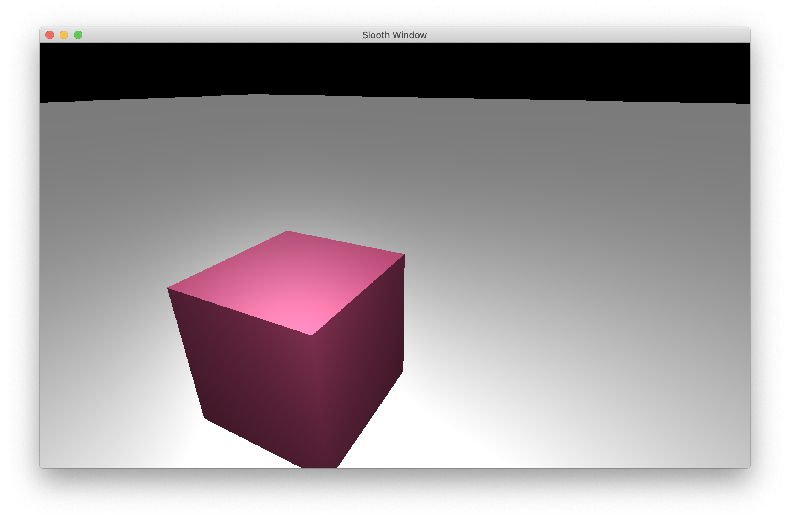

# Slooth

Very much a WIP. A **High and low level** C++ graphics API. With abstractions you might see in SDL or SFML 
but with the capability to design specific renderable objects and render pipelines.

<!--
## Program Hierarchy


-->

## Example Program

This is a quick program to create and draw a plane.
The default camera methods allow the user to move around with WASD.
```c++
#include "core/window.hpp"
#include "core/camera.hpp"
#include "objects/plane.hpp"

using namespace slt;

const unsigned int SCR_WIDTH = 1000;
const unsigned int SCR_HEIGHT = 600;

int main()
{
    window::init(SCR_WIDTH, SCR_HEIGHT, (char*)"Slooth Window");

    Camera camera(45.0, {0, 1, -10});

    Plane plane(10, 10, 1000, 1000);

    window::setMouseLocked(true);

    while (!window::shouldClose())
    {
        // Input checking to unlock the cursor
        window::loadInputs();
        if (window::isPressed(Key::ESCAPE)) {
            window::toggleMouseLocked();
        }

        // Camera movement
        camera.pollDefaultMovementInputs();

        // Displaying object
        window::fill(0, 0, 0, 1);

        camera.drawObject(plane);

        window::display();
    }

    window::terminate();
}
```

With the window displaying a 2D plane in a 3D traversable world:




