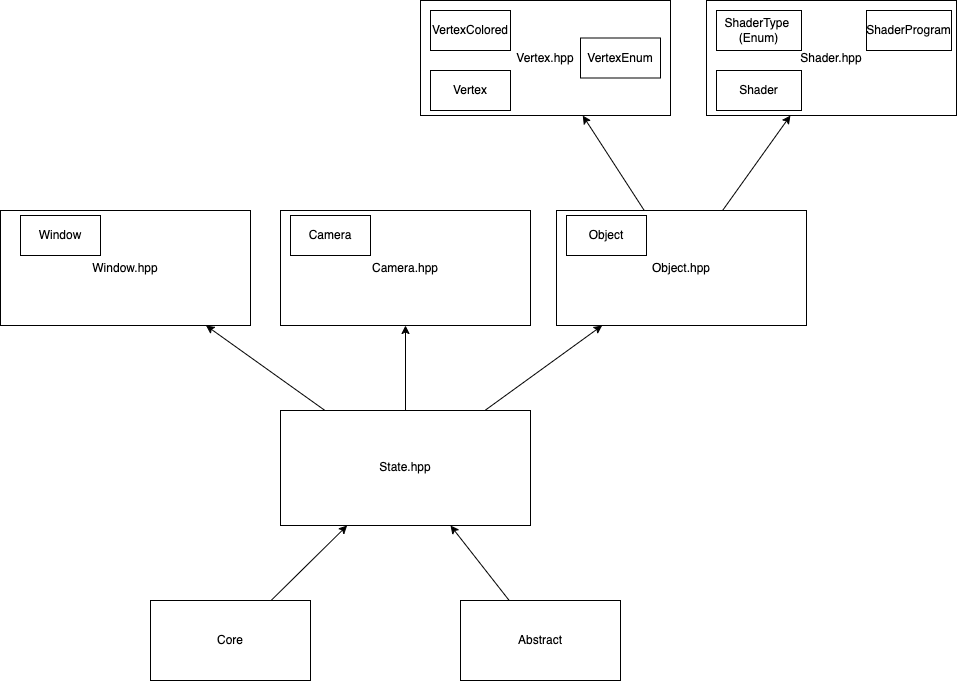

# Slooth

Very much a WIP. A **High and low level** C++ graphics API. With abstractions you might see in SDL or SFML 
but with the capability to design specific renderable objects and render pipelines.

## Program Hierarchy

